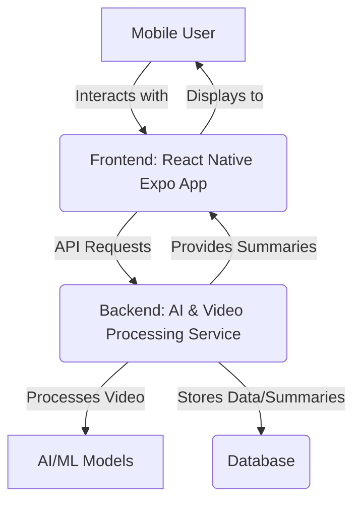

# AI-Powered-Video-Summarization-Mobile-App-React-Native-Expo


## Bottom Line Up Front (BLUF)

This project delivers an **AI-powered mobile application** designed to revolutionize how you consume video content. Built with **React Native** and **Expo**, it offers a seamless cross-platform experience (iOS and Android) for transforming lengthy videos into concise, actionable summaries. Save invaluable time, quickly grasp key insights, and boost your overall productivity by distilling complex video information with intelligent summarization technology. Experience the future of efficient content consumption right on your mobile device! 🚀💡

## Key Features

*   **Intelligent Video Summarization:** Leverage advanced AI algorithms to condense long videos into digestible key points and summaries.
*   **Cross-Platform Mobile App:** Enjoy a native-like experience on both iOS and Android, powered by React Native and Expo.
*   **User-Friendly Interface:** Intuitive design for easy video input (via URL or upload) and summary viewing.
*   **Time-Saving:** Quickly get the gist of lectures, meetings, news, or tutorials without watching the entire video.
*   **Scalable Backend:** Designed with a modular backend capable of handling video processing and AI inference efficiently.

## Technical Architecture

This application follows a robust client-server architecture, ensuring a clear separation of concerns and scalability.



### Project Structure

```
. # AI-Powered-Video-Summarization-Mobile-App-React-Native-Expo
├── .expo/               # Expo project configuration and build artifacts
├── backend/             # Microservice for AI-driven video processing and API
│   ├── src/             # Backend source code (e.g., Python/Flask or Node.js/Express)
│   ├── Dockerfile       # Containerization for backend deployment
│   └── requirements.txt # Backend dependencies
└── frontend/            # React Native Expo mobile application
    ├── assets/          # Application assets (images, fonts)
    ├── src/             # Frontend source code (TypeScript React Native components)
    ├── app.json         # Expo application configuration
    └── package.json     # Frontend dependencies
```

## Technologies Used

### Frontend (Mobile Application)

*   **React Native:** A powerful framework for building native mobile apps using JavaScript/TypeScript.
*   **Expo:** A set of tools and services for building, deploying, and quickly iterating on universal React applications.
*   **TypeScript:** For enhanced code quality, maintainability, and developer experience.

### Backend (API & AI Processing)

*   **Flexible Backend:** Designed to be implemented with suitable technologies like Python (Flask/FastAPI) for AI/ML heavy lifting or Node.js (Express) for API services.
*   **AI/ML Libraries:** (e.g., TensorFlow, PyTorch, Hugging Face Transformers) for summarization and video transcription.
*   **Containerization:** Docker for consistent environment setup and deployment.

## Getting Started

Follow these steps to set up and run the AI-Powered Video Summarization app locally.

### Prerequisites

Ensure you have the following installed:

*   [Node.js](https://nodejs.org/) (LTS recommended)
*   [npm](https://www.npmjs.com/) or [Yarn](https://yarnpkg.com/)
*   [Expo CLI](https://docs.expo.dev/get-started/installation/) (`npm install -g expo-cli`)
*   [Python](https://www.python.org/) (3.8+) and [pip](https://pip.pypa.io/en/stable/installation/) (for backend)
*   [Docker](https://www.docker.com/products/docker-desktop/) (optional, for containerized backend deployment)

### 1. Clone the Repository

```bash
git clone https://github.com/YOUR_USERNAME/AI-Powered-Video-Summarization-Mobile-App-React-Native-Expo.git
cd AI-Powered-Video-Summarization-Mobile-App-React-Native-Expo
```

### 2. Backend Setup

Navigate to the `backend` directory and install dependencies.

```bash
cd backend
pip install -r requirements.txt
# Or, if using Docker:
docker build -t videosum-backend .
docker run -p 8000:8000 videosum-backend

# Start the backend server (example using Flask)
# python src/app.py 
# (Refer to backend/README.md for specific backend startup instructions)
cd ..
```

### 3. Frontend Setup

Navigate to the `frontend` directory and install dependencies.

```bash
cd frontend
yarn install # or npm install

# Start the Expo development server
npm start # or yarn start
```

This will open a new tab in your browser with the Expo Developer Tools. You can then:

*   Scan the QR code with your phone using the [Expo Go app](https://expo.dev/client) (iOS/Android).
*   Run on an Android emulator.
*   Run on an iOS simulator (macOS only).

## Contributing

We welcome contributions to make this AI-powered video summarization app even better! Please refer to our `CONTRIBUTING.md` (to be created) for guidelines on how to submit issues, pull requests, and propose new features.

## License

This project is licensed under the MIT License - see the [LICENSE](LICENSE) file for details.

## Support

If you find this project useful, please consider giving it a **Star ⭐** on GitHub! Your support helps us to continue developing and improving this application. Thank you!